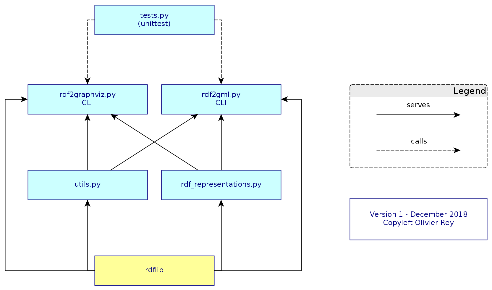

# 'Data' is quite a vague name...

However, this set of python tools have 2 purposes:

  * Provide a simple set of tools to display RDF graphs
  * Provide a simple set of tools to convert data into RDF graphs
  
For sure the combining of those 2 sets of tools enables to use RDF as a pivot format to explore linked data.

## Basic data viz



Python files and CLI

## CSV Tools

[To be written]

-------

## rdf2graphviz comments

### Mapping web semantic concepts to graphs

We face 2 structural differences between graph and semantic web RDF.

#### 1. Edges are not edges

To be able to display triples, we have to take some options. In RDF, the predicate can be itself the subject or the object of other triples. That means that the predicate is not an "edge" in the graph sense of the term.

Moreover, in pure RDF, if we have ```d1:s1 d2:p d3:o1 .``` and ```d1:s2 d2:p d3:o2 .```, "d2:p" is one and only one object whereas 2 triples are using it.

So we must find a convention of representation.

### 2. Emulating a knowledge graph into a graph

In a standard graph representation, we will choose to focus on nodes and to use "d2:p" as a label of both ```d1:s1 -> d3:o1``` and ```d1:s2 -> d3:o2``` relationships. That's the first option of representation that we have chosen to implement.

The second option that we have chosen to represent is creating a box around each of the relations. In that case "d2:p" will appear in several boxes between the nodes of the subject and the node of the subject.

This way of representing is not perfect because:

  * "d2:p" will be represented several times whereas in the real knowledge graph, it exists only once.
  * If, in the same knowledge graph, we have something like ```d2:p d4:q d5:r .``` (case of "d2:p" being a subject to another triple) or "d2:p" is the object of another triple, "d2:p" will also appear as a node (on top of being potentially labels or rectangles in relationships).

In a way, we chose to "emulate" the knowledge graph in a graph considering as primary objects "subject" and "object" and as secondary objects "predicate" - except when a predicate becomes subject or object.

Technically that means that the representation of the knowledge graph will ensure node unicity (subject/object used in several triples) but will create graphical instances of the same predicate if need be.

Concretely:

  * BNode instances and Literal instances are considered unique nodes;
  * URIRef is instanciated for each edge.

## CSV To RDF Comments

### Comments about the semantic parser

Vocabulary hypothesis: triples are decomposed in subject, predicate, object. Subjects and objects are roles that can be endorsed by URIRefs or Literal or blank nodes.

Despite the fact that there may be lists in some fields, we'll try not to use any blank node concept.

### Grammar

The semantic parser works with a semantic simplistic grammar. The idea of this grammar is to identify how the 3 following informations should be dealt with:

  * Line identifier
    * Each line is an instance of a particular concept. One column will contain the ID of the line. It will be the "master subject" that we will name `subject1`. `subject1` will be potentially used for triple generations when treating the rest of the cells.
  * Column name: generally used as a predicate.
  * Cell value: can be a Literal, an object or a subject. Can be related to `subject1` or not.

The grammar proposes the following semantic:

  * CSV line = `colum-name;command`
    * Possible evolution: use standard config file not to use CSV separators
  * colum-name will be formated with `_` by the parser (in case the column name has spaces in it)
  * command grammar = `role|type|direction|name` OR `ignore`, separator is `|`
    * Possible evolution: change separators
  * role =
    * `subject1` for the primary subject
	* `subject2` for others
	  * `subject2` is here to flag the cell as a subject or object. The fact that `subject2` be a subject or object is determine by the direction.
  * type = the type of the subject
    * Possible evolution: the type should be "defined" especially in a Turtle file. It should be an alias.
  * direction =
    * `S` for standard (meaning `subject1 predicate object`)
	* `R` for reverse (meaning `object predicate subject1`)
  * name = a string that describe better the predicate than the column name.
    * Possible evolution: the predicate type should be defined in a Turtle file. It should be an alias.
	* If this is not provided, the colum name is predicatified and is declared in the domain of the file.

Examples:

  * column_i;subject1|PN
  * column_j;subject2|PN|S|Father
  * column_k:literal
  * column_p;ignore

Note: the parser eliminates UTF8 errors.

----

See also:

  * [RDF design patterns](RDF_DESIGN_PATTERNS) (work in progress)
